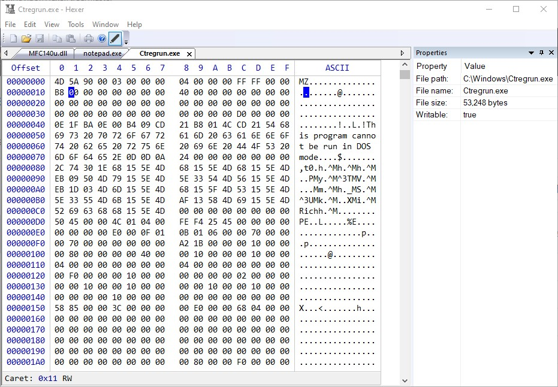

## Hexer
Fast, fully-featured, multi-tab hexadecimal editor, based on the [HexCtrl](https://github.com/jovibor/HexCtrl).

## Features 
* View and edit Files, Disks, Partitions and Processes, up to **16EB** (exabyte)
* Fully-featured **Bookmarks Manager**
* Fully-featured **Search and Replace**
* Many options to **Copy/Paste** to/from the clipboard
* **Undo/Redo**
* Modify data with **Filling** and many **Operations** options
* Ability to visually divide data into pages
* Powerful system of Templates
* And many more.

## How To Build
1. Clone git repo with all submodules:  
`git clone https://github.com/jovibor/Hexer.git --recurse-submodules`
1. Open `Hexer\Hexer.sln` solution in the **Visual Studio 2022** or newer

## About Hexer
**Hexer** is a free, open-source hex editor for Windows. It's developed with the MFC library, but its core component is [HexCtrl](https://github.com/jovibor/HexCtrl). **Hexer** is mostly a hobby project developed in spare time.

## License
**Hexer** is available under **"The Hexer License"**, see the [LICENSE](https://github.com/jovibor/Hexer/blob/master/LICENSE) file.