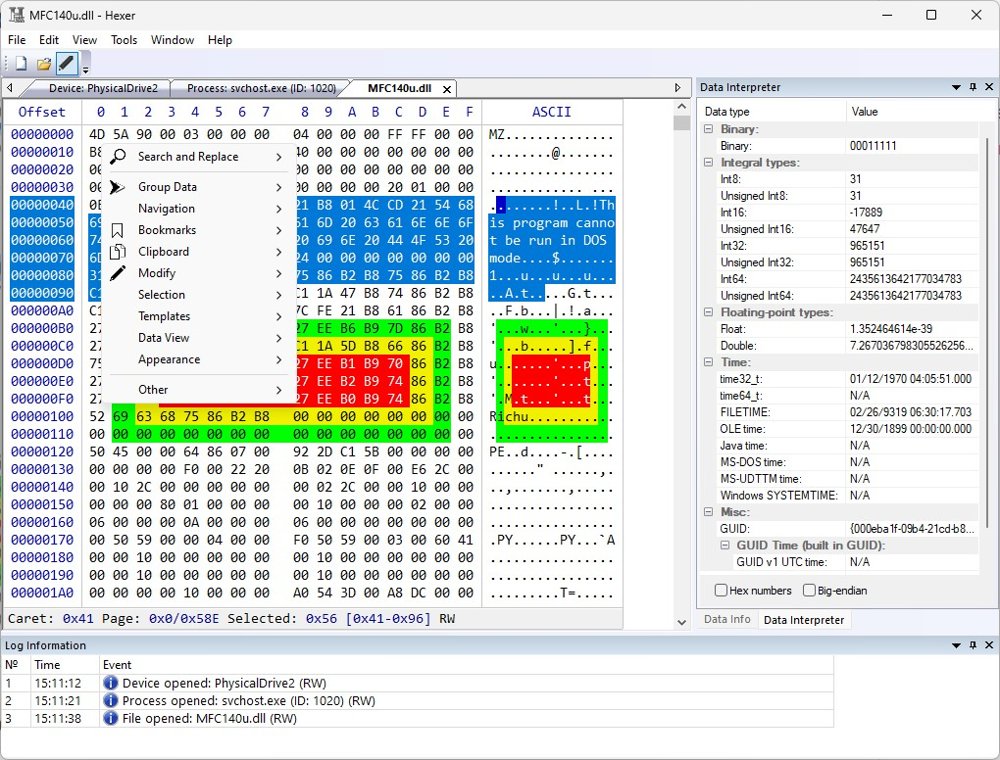

## Hexer
**Hexer** is a free, fast, multi-tab hex editor, based on the [HexCtrl](https://github.com/jovibor/HexCtrl), and developed with the MFC library. **Hexer** is mostly a hobby project developed in spare time.



## Features 
* View and edit Files, Disks, Partitions and Processes, up to **16EB** (exabyte)
* Fully-featured **Bookmarks Manager**
* Fully-featured **Search and Replace**
* Many options to **Copy/Paste** to/from the clipboard
* **Undo/Redo**
* Modify data with **Filling** and many **Operations** options
* Ability to visually divide data into pages
* Powerful system of [Templates](#templates)
* And many more...

## How To Build
1. Clone git repo with all submodules:  
`git clone https://github.com/jovibor/Hexer.git --recurse-submodules`
1. Open `Hexer\Hexer.sln` solution in the **Visual Studio 2022** or newer

## [](#)Templates
  
**Hexer**'s templates is a powerful system of a data structures' description with a simple `.json` file.
```json
{
    "$schema": "https://raw.githubusercontent.com/jovibor/HexCtrl/master/docs/HexCtrl.Templates.Schema.json",
    "TemplateName": "SampleTemplate",
    "Data": {
        "endianness": "little",
        "clrBk": "#999999",
        "clrText": "#FFFFFF",
        "Fields": [
            {
                "name": "MyCustomDataSingle",
                "type": "MyCustomType"
            },
            {
                "name": "CustomComplexData",
                "type": "MyCustomComplexType"
            },
            {
                "name": "ArrayOfDWORDs",
                "type": "DWORD",
                "array": 10
            },
            {
                "name": "MyCustomDataArray",
                "type": "MyCustomType",
                "array": 4
            }
        ]
    },
    "CustomTypes": [
        {
            "TypeName": "MyCustomType",
            "Fields": [
                {
                    "name": "myCustomTypeField1",
                    "type": "DWORD"
                },
                {
                    "name": "myCustomTypeField2",
                    "type": "DWORD"
                }
            ]
        },
        {
            "TypeName": "MyCustomComplexType",
            "Fields": [
                {
                    "name": "MyCustomTypeData1",
                    "type": "MyCustomType"
                },
                {
                    "name": "MyCustomTypeData2",
                    "type": "MyCustomType"
                }
            ]
        }
    ]
}
```
Every such file contains the following properties:  
- **TemplateName** [mandatory, string] - the name of the template
- **Data** [mandatory, object] - main object that contains all template field's information
- **CustomTypes** [optional, array] - array of a user defined types, that can be then referenced in the **type** property of the **Fields**

**CustomTypes** objects are the same as **Fields** objects, the only difference is the **TypeName** property which **Fields** objects don't have.  

Every **Data** or **CustomType** object contains **Fields** property with actual struct members.  

**Fields** [array] - is an array of objects where every object represents a struct data member. Any such object can have its own **Fields** sub-objects, which will represent nested structs.  
The **Fields**'s properties include:
- **name** - [mandatory, string] - name of the field
- **description** - [optional, string] - field description
- **type** - [optional, string] - field type, such as:  
`bool`, `char`, `unsigned char`, `byte`, `short`, `unsigned short`, `WORD`, `long`, `unsigned long`, `int`, `unsigned int`, `DWORD`, `long long`, `unsigned long long`, `QWORD`, `float`, `double`, `time32_t`, `time64_t`, `FILETIME`, `SYSTEMTIME`, `GUID`, or any custom type defined in the **CustomTypes** section
- **size** - [optional, int] - size of the field in bytes, if the **type** field is not provided
- **array** - [optional, int] - size of the array, if the given field is an array of fields
- **endianness** - [optional, string] - field endianness, "little" or "big". By default all fields are little-endian.
- **clrBk** - [optional, string] - field background color
- **clrText** - [optional, string] - field text color

The **endianness**, **clrBk** and **clrText** properties that locate at the same level as the **Fields** property, would mean the default properties for all the **Fields** objects of that level and below the line, unless they explicitly redefined in the field itself.  

For the available templates check the `Templates` directory.

## License
**Hexer** is available under **"The Hexer License"**, see the [LICENSE](https://github.com/jovibor/Hexer/blob/master/LICENSE) file.